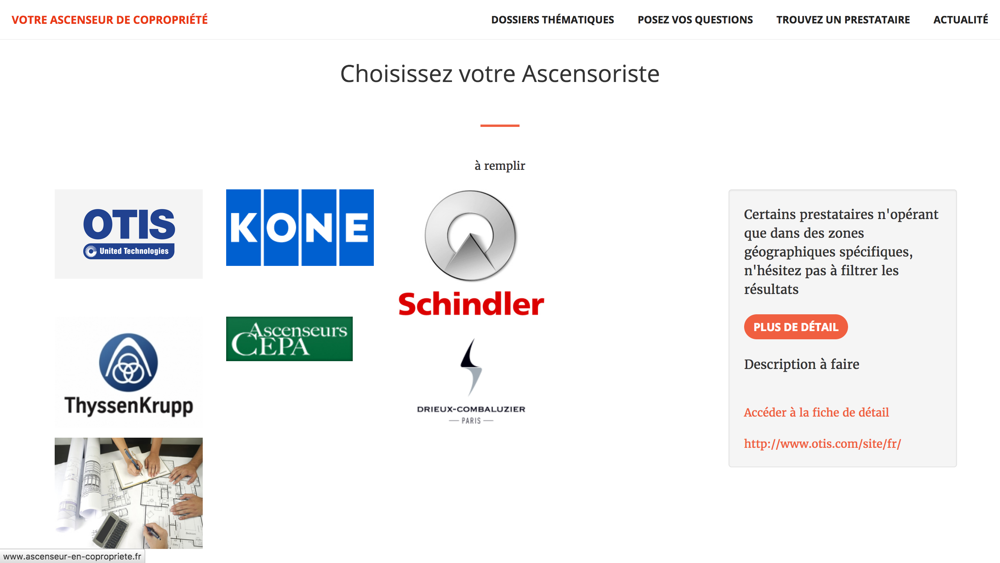
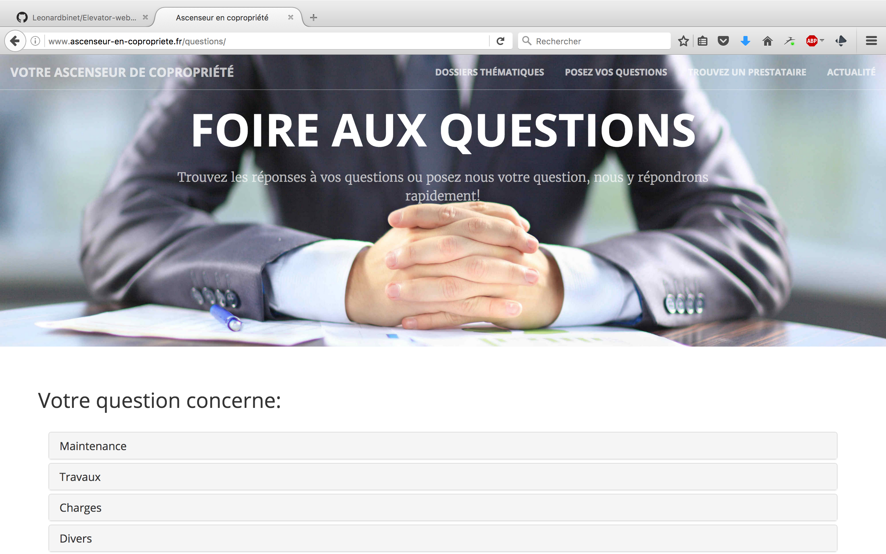

# Ascenseur en copropriete

## Objectif

Il a pour objectif de fournir des conseils aux copropriétaires sur les enjeux liés à leur ascenseur.

## Architecture

Ce site est basé sur deux frameworks:
- Django pour la partie backend (python).
- Bootstrap pour la partie frontend (HTML, javascript, CSS).

## TODO

- Ecriture d'articles avant tout
- Améliorer affichage mobile sur petits devices

## Screenshots
  
  
  
